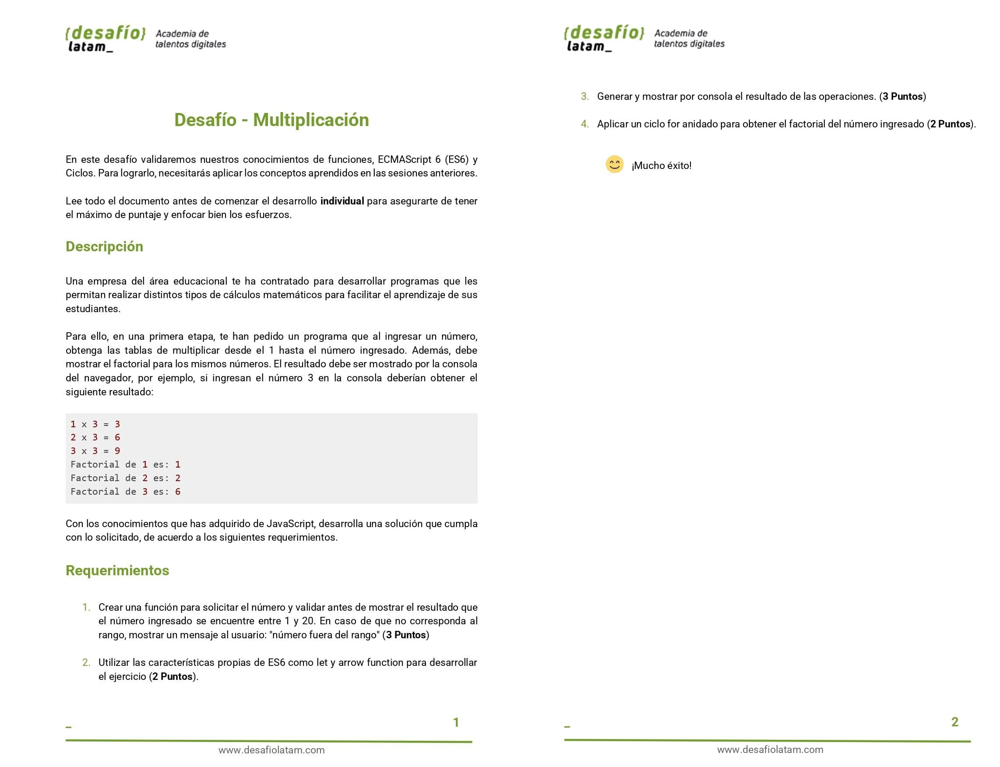
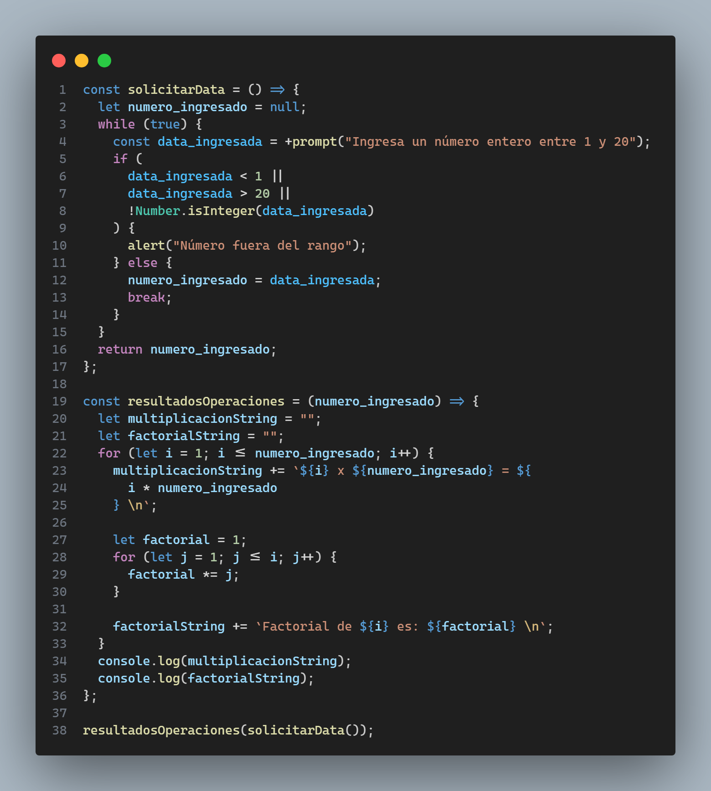

Repositorio con el código del desafío Multiplicación del módulo 3 llamado **Fundamentos de programación en JavaScript** el cual es **obligatorio** de hacer y entregar. Los requisitos del proyecto son los siguientes:

El desafío es sencillo y el código es el siguiente:

